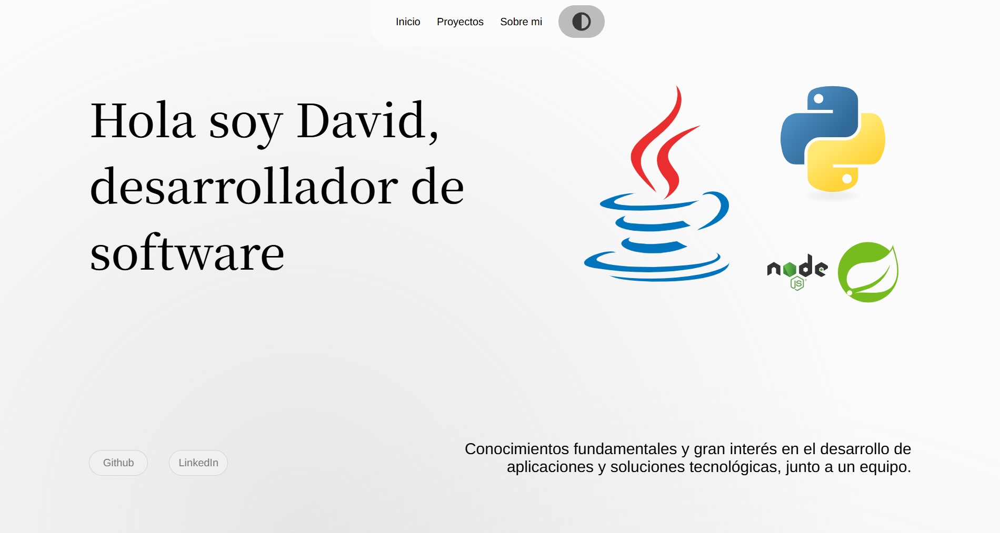

# 👋 Hola, soy David

💻 Desarrollador de Software en busca de practicas. Aqui podras ver algunos de mi proyectos que he estado haciendo por mi cuenta aplicando los conocimientos en cada tecnologia.

🔗 **Portafolio online:** [[link aquí](https://marquezado.github.io/my_portfolio/)]

---

## 🧑‍💼 Sobre mí

Cuento con formación académica en Java, Javascript y Python. Complementada con aprendizaje autodidacta y desarrollo de proyectos practicos.

Actualmente estoy buscando oportunidades para aplicar mis conocimientos y seguir desarrollando habilidades a un entorno profesional.

---

## 🛠️ Tecnologías y herramientas

**Frontend:**  
- HTML, CSS, JavaScript  
- React

**Backend:**  
- Node.js, Express  
- Python / Java 

**SQL:**
- Mysql
- Postgres

**Otros:**  
- Git, Docker, Firebase, ORM (Hibernate, Prisma) etc.
